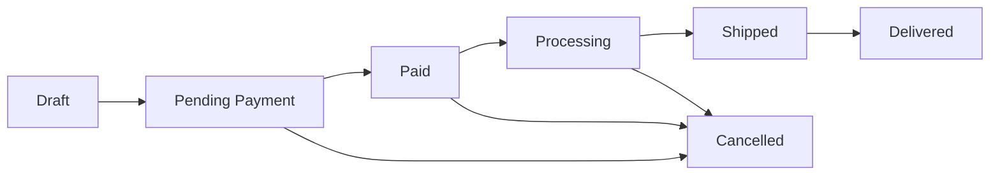

# Business Rules - La Aldea E-Commerce

**Date:** January 16, 2026  
**Owner:** Martín Betancor / La Aldea  
**Purpose:** Define business logic for e-commerce platform

---

## 📋 Table of Contents

1. [Order Lifecycle](#order-lifecycle)
2. [Stock Management](#stock-management)
3. [Pricing & Discounts](#pricing--discounts)
4. [Shipping Rules](#shipping-rules)
5. [Payment Processing](#payment-processing)
6. [Customer Rules](#customer-rules)
7. [Return & Cancellation](#return--cancellation)
8. [Webhook & Idempotency](#webhook--idempotency)

---

## 🔄 Order Lifecycle

### Order States



### State Definitions

#### 1. **Draft** (`draft`)
- **When:** Customer is still building their cart
- **Stock:** Not reserved
- **Visibility:** Only visible to customer session
- **Duration:** Auto-delete after 30 days of inactivity
- **Actions allowed:**
  - ✅ Add/remove items
  - ✅ Modify quantities
  - ✅ Apply coupons
  - ✅ Proceed to checkout

#### 2. **Pending Payment** (`pending`)
- **When:** Checkout initiated, awaiting MercadoPago confirmation
- **Stock:** ⚠️ **RESERVED** (soft reservation, not committed)
- **Duration:** 24 hours before auto-cancellation
- **MercadoPago Status:** `pending`, `in_process`, `in_mediation`
- **Actions allowed:**
  - ✅ View order details
  - ✅ Complete payment
  - ✅ Cancel order
  - ❌ Modify items

**✅ DECISION MADE:**
- **Reserve stock only after payment confirmation** (Option B)
- **Rationale:** Low concurrent purchase risk, simpler implementation
- **⚠️ Known issue:** Physical store sales sometimes bypass system (no stock tracking)
- **Future consideration:** Implement POS system for physical store to sync stock

#### 3. **Paid** (`paid`)
- **When:** MercadoPago confirms successful payment
- **Stock:** ✅ **COMMITTED** (stock decremented from inventory)
- **MercadoPago Status:** `approved`
- **Notification:** Email sent to customer + admin
- **Actions allowed:**
  - ✅ View order details
  - ✅ Request cancellation (with approval)
  - ❌ Modify items

**Automatic transition to `processing` after:**
- ⏱ Immediate (if auto-fulfillment enabled)
- ⏱ Manual confirmation by staff

**⚠️ DECISION NEEDED:**
- **Should paid orders automatically move to processing, or require manual confirmation?**
  
**Your preference:** _[TO BE DECIDED]_

#### 4. **Processing** (`processing`)
- **When:** Order is being prepared for shipment
- **Staff actions:**
  - Picking items from warehouse
  - Quality check
  - Packaging
  - Generating shipping label
- **Duration:** Target 24-48 hours
- **Customer notifications:** Order is being prepared

#### 5. **Shipped** (`shipped`)
- **When:** Order handed to carrier
- **Required data:**
  - Tracking number
  - Carrier name
  - Estimated delivery date
- **Notification:** Email with tracking link
- **Actions allowed:**
  - ✅ Track shipment
  - ✅ Request delivery changes (if carrier allows)

#### 6. **Delivered** (`delivered`)
- **When:** Carrier confirms delivery OR customer confirms receipt
- **Actions allowed:**
  - ✅ Request return (within return window)
  - ✅ Leave review

**⚠️ DECISION NEEDED:**
- **Return window after delivery?**
  - Standard: 7 days
  - Extended: 15 days
  - Custom: ___ days
  
**Your preference:** _[TO BE DECIDED]_

#### 7. **Cancelled** (`cancelled`)
- **When:** Order cancelled before shipment
- **Stock:** Released back to inventory
- **Refund:** Automatic if already paid
- **Reasons:**
  - Customer request
  - Payment failed
  - Out of stock
  - Fraud detection
  - Timeout (24h pending)

**⚠️ DECISION NEEDED:**
- **Who can cancel paid orders?**
  - Customer: Up to X hours after payment
  - Admin: Always
  - Automatic: After X days if not processed
  
**Your preference:** _[TO BE DECIDED]_

---

## 📦 Stock Management

### Stock Reservation Strategy

#### Scenario 1: Customer adds item to cart
```
Action: None (draft state)
Stock: Available for other customers
Duration: Until checkout
```

#### Scenario 2: Customer proceeds to checkout
```
Action: [DECISION NEEDED]
  Option A: Soft reserve (stock_reserved++)
  Option B: No reservation until payment
```

**⚠️ DECISION NEEDED:**
- **Reserve stock at checkout or only after payment?**

**Your preference:** _[TO BE DECIDED]_

#### Scenario 3: Payment confirmed
```
Action: Commit stock
SQL: UPDATE products SET stock_quantity = stock_quantity - order_quantity
Trigger: On MercadoPago webhook "approved"
```

#### Scenario 4: Order cancelled
```
Action: Release stock
SQL: UPDATE products SET stock_quantity = stock_quantity + order_quantity
Trigger: On order status change to "cancelled"
```

### Stock Levels & Thresholds

**⚠️ DECISION NEEDED - Define your stock thresholds:**

| Threshold | Suggested Value | Action | Your Value |
|-----------|----------------|---------|------------|
| **Critical Low** | 5 units | Alert admin, hide from homepage | _[TO BE DECIDED]_ |
| **Low Stock** | 10 units | Show "Only X left" badge | _[TO BE DECIDED]_ |
| **Normal Stock** | 11+ units | Normal display | - |
| **Out of Stock** | 0 units | Show "Out of Stock", disable purchase | 0 (fixed) |

**Stock Display Rules:**
- Show exact quantity: Up to X units (e.g., "Only 3 left!")
- Show "Low stock": Between X-Y units
- Show "In stock": Y+ units
- Show "Out of stock": 0 units

**⚠️ DECISION NEEDED:**
- **Show exact stock numbers to customers?**
  - Yes: "3 units available"
  - No: Just "In stock" / "Low stock"
  
**Your preference:** _[TO BE DECIDED]_

### Overselling Prevention

**Rules:**
1. ✅ Check stock availability before checkout
2. ✅ Validate stock again before payment processing
3. ✅ Use database transactions for stock updates
4. ✅ Handle concurrent orders with row locking

**Database Implementation:**
```sql
-- Prevent negative stock
ALTER TABLE products ADD CONSTRAINT check_positive_stock 
CHECK (stock_quantity >= 0);

-- Atomic stock decrement with validation
UPDATE products 
SET stock_quantity = stock_quantity - $quantity
WHERE id = $product_id 
  AND stock_quantity >= $quantity
RETURNING *;
```

**⚠️ DECISION NEEDED:**
- **Allow backorders (selling more than current stock)?**
  - Yes: Accept orders, notify customer of delay
  - No: Hard limit at current stock
  
**Your preference:** _[TO BE DECIDED]_

---

## 💰 Pricing & Discounts

### Base Pricing

**Currency:** UYU (Uruguayan Peso)
**VAT:** 22% (included in displayed prices)
**Price Display:** Always show final price with VAT included

**⚠️ DECISION NEEDED:**
- **Show prices with or without VAT?**
  - Standard for Uruguay: Include VAT (22%)
  - Business customers: May want VAT excluded prices option
  
**Your preference:** _[TO BE DECIDED]_

### Coupon System

#### Coupon Rules

**Coupon Types:**
1. **Percentage Discount** (e.g., 10% off)
2. **Fixed Amount** (e.g., $500 UYU off)
3. **Free Shipping** (waive shipping fee)
4. **Buy X Get Y** (e.g., Buy 2 get 1 free)

**✅ COUPON RULES DECIDED:**

| Rule | Decision |
|------|----------|
| **Coupons per order** | **1 coupon only** (no stacking) |
| **Minimum purchase** | Optional per coupon (e.g., $2000 UYU minimum) |
| **User limit** | Configurable per coupon (1 use or unlimited) |
| **Total redemptions** | Configurable per coupon |
| **Expiry required** | Always require expiration date |
| **Primary use case** | Loyalty rewards for repeat/long-term customers |

#### Coupon Application Order

**When multiple discounts exist:**
1. Apply coupon discount first
2. Calculate on subtotal (before shipping)
3. Add shipping cost
4. Calculate final total

**Example:**
```
Subtotal: $10,000 UYU
Coupon: 10% off → -$1,000 UYU
Subtotal after discount: $9,000 UYU
Shipping: $300 UYU
Total: $9,300 UYU
```

**⚠️ DECISION NEEDED:**
- **Can coupons be combined with sale prices?**
  - Yes: Coupon applies on already discounted items
  - No: Coupon only on regular-priced items
  
**Your preference:** _[TO BE DECIDED]_

### Product Pricing Tiers

**⚠️ DECISION NEEDED - Do you want volume pricing?**

**Example:**
- 1-5 units: $1,000 each
- 6-20 units: $950 each (5% off)
- 21+ units: $900 each (10% off)

**Your preference:** _[YES / NO] [TO BE DECIDED]_

---

## 🚚 Shipping Rules

### Shipping Zones & Costs

**✅ HYBRID SHIPPING STRATEGY:**

#### Courier (DAC) - Standard Items
```
Small/Medium items (pumps, tools, chemicals, filters):
  - Canelones/Montevideo: $300 UYU
  - Other departments: $400 UYU
  - Free shipping: Orders over $5,000 UYU

Size limitations: Cannot ship large items (tanks, big equipment)
```

#### Own Delivery Service - Large Items
```
Large items (tanks, heavy equipment):
  - Manual quote based on:
    * Distance from Tala
    * Item size/weight
    * Accessibility
  - Preference: Local/nearby deliveries
  - Note: Far buyers rarely purchase large items due to cost
```

#### In-Store Pickup (FREE)
```
All items available for pickup:
  - Address: José Alonso y Trelles y Av Artigas, Tala
  - Hours: Mon-Fri 8-18, Sat 8:30-12
  - No shipping cost
```

**Implementation Strategy:**
- **Phase 1 (Week 2-3):** Courier flat rates + pickup option
- **Phase 2 (Week 4+):** Add "Request Quote" for large items
- **Future:** Implement distance-based calculator for own delivery

**⚠️ PENDING DISCUSSION:**
- Exact pricing tiers for own delivery service
- Maximum delivery radius for own service
- Installation service pricing (pumps, irrigation systems)

### Free Shipping Threshold

**⚠️ DECISION NEEDED:**
- **Free shipping minimum:** $_____ UYU
- **Applies to:** All zones OR Only nearby zones?
- **Excluded products:** Heavy items (pumps, tanks) OR All products eligible?

**Your preference:** _[TO BE DECIDED]_

### Delivery Times

**⚠️ DECISION NEEDED - Estimated delivery windows:**

| Zone | Delivery Time | Your Decision |
|------|---------------|---------------|
| Tala (local) | 24-48 hours | _[TO BE DECIDED]_ |
| Canelones/Montevideo | 2-4 business days | _[TO BE DECIDED]_ |
| Other departments | 3-7 business days | _[TO BE DECIDED]_ |
| Remote areas | 5-10 business days | _[TO BE DECIDED]_ |

### Installation Services

**⚠️ DECISION NEEDED:**
- **Offer installation for certain products?**
  - Pumps, irrigation systems: Optional installation service (+$X UYU)
  - Cost calculation: Per product OR Manual quote?
  
**Your preference:** _[TO BE DECIDED]_

---

## 💳 Payment Processing

### Accepted Payment Methods (via MercadoPago)

**Included by default:**
- ✅ Credit cards (Visa, Mastercard, etc.)
- ✅ Debit cards
- ✅ MercadoPago balance
- ✅ Bank transfers (Pagofácil, Abitab, Redpagos)

**Installments:**
- ✅ 1-12 installments (as per MercadoPago rules)
- Interest: Set by MercadoPago/issuer

**⚠️ DECISION NEEDED:**
- **Accept installments?**
  - Yes: Allow MercadoPago default (up to 12x)
  - Limited: Maximum X installments
  - No: Cash payments only
  
**Your preference:** _[TO BE DECIDED]_

### Payment Timeout

**Rule:** Orders in `pending` state for >24 hours automatically cancel

**Exceptions:**
- Bank transfers: Extended to 72 hours (3 days)
- Pagofácil/Abitab: Extended to 72 hours

**⚠️ DECISION NEEDED:**
- **Payment timeout:** 24 hours OR 48 hours OR 72 hours?

**Your preference:** _[TO BE DECIDED]_

---

## 👤 Customer Rules

### Account Requirements

**✅ DECISION MADE:**
- **Guest checkout ALLOWED**
- **Rationale:** Lower friction, increase conversions
- **Option:** Offer account creation after checkout with order history
- **Future:** Encourage account creation with benefits (saved addresses, order tracking, exclusive coupons)

### Customer Data Collection

**Required fields:**
- Full name
- Email
- Phone number
- Delivery address
- CI/RUT (tax ID)

**Optional fields:**
- Company name (for businesses)
- Secondary phone

**⚠️ DECISION NEEDED:**
- **Require CI/RUT for all orders or only >$X UYU?**
  
**Your preference:** _[TO BE DECIDED]_

---

## 🔄 Return & Cancellation

### Return Policy

**⚠️ DECISION NEEDED - Define return rules:**

| Aspect | Your Decision |
|--------|---------------|
| **Return window** | ___ days after delivery _[TO BE DECIDED]_ |
| **Condition required** | Unopened/unused OR Any condition? _[TO BE DECIDED]_ |
| **Refund method** | Store credit OR Money back? _[TO BE DECIDED]_ |
| **Return shipping cost** | Customer pays OR Free returns? _[TO BE DECIDED]_ |
| **Restocking fee** | No fee OR X% fee? _[TO BE DECIDED]_ |

### Non-Returnable Items

**Common exclusions:**
- Custom-ordered items
- Chemical products (DIU)
- Opened electrical items
- Items without original packaging

**⚠️ DECISION NEEDED:**
- **Which products can't be returned?**

**Your preference:** _[TO BE DECIDED]_

### Cancellation Before Shipment

**Rules:**
- Customer can cancel: Up to ___ hours after payment _[TO BE DECIDED]_
- After that: Requires admin approval
- Refund: Automatic via MercadoPago

---

## 🔔 Webhook & Idempotency

### MercadoPago Webhook Processing

#### Idempotency Strategy

**Problem:** MercadoPago may send the same webhook multiple times
**Solution:** Check `mp_payment_id` before processing

**Implementation:**
```typescript
// Check if payment already processed
const existing = await db.query(
  'SELECT id FROM orders WHERE mp_payment_id = $1',
  [paymentId]
);

if (existing.rows.length > 0) {
  console.log('Payment already processed, skipping');
  return res.status(200).json({ received: true });
}

// Process payment...
```

#### Webhook Verification

**Security checks:**
1. ✅ Verify request signature (x-signature header)
2. ✅ Validate payment ID with MercadoPago API
3. ✅ Check payment status
4. ✅ Verify payment amount matches order total
5. ✅ Update order status atomically

#### Status Mapping

| MercadoPago Status | La Aldea Order Status | Action |
|--------------------|----------------------|--------|
| `pending` | `pending` | Wait for confirmation |
| `approved` | `paid` → `processing` | Decrement stock, send confirmation |
| `authorized` | `paid` | Capture payment |
| `in_process` | `pending` | Wait (bank transfer processing) |
| `in_mediation` | `pending` | Wait (dispute resolution) |
| `rejected` | `cancelled` | Release stock |
| `cancelled` | `cancelled` | Release stock |
| `refunded` | `refunded` | Return stock |
| `charged_back` | `refunded` | Return stock, notify admin |

---

## 🏪 Physical Store Integration Challenge

### Current Situation

**Problem:** Physical store (Tala location) operates without integrated stock control:
- Some sales made without billing (no IVA/tax invoice)
- Stock changes not recorded in any system
- Manual inventory tracking
- E-commerce stock may be inaccurate due to physical store sales

### Short-term Solution (Phase 1)

**For e-commerce launch:**
1. **Manual stock sync:** Staff updates e-commerce stock daily/weekly
2. **Buffer stock:** Set e-commerce stock slightly lower than actual (safety margin)
3. **Order confirmation:** Admin manually confirms orders before processing
4. **Low stock alerts:** Email admin when products reach threshold

### Long-term Solution (Phase 2+)

**Future POS integration:**
1. Implement POS system for physical store
2. Sync physical + online stock in real-time
3. Proper billing for all sales (IVA compliance)
4. Unified inventory management

**⚠️ INTERIM WORKFLOW:**
```
1. Customer places online order
   ↓
2. Order shows as "Paid" (payment confirmed)
   ↓
3. Admin receives notification
   ↓
4. Admin checks physical store stock
   ↓
5. If available → Mark "Processing" → Fulfill
6. If not available → Contact customer → Cancel/refund OR wait for restock
```

---

## 📊 Business Metrics & KPIs

### Order Metrics to Track

**⚠️ DECISION NEEDED - Which metrics matter most?**

- [ ] Average order value (AOV)
- [ ] Conversion rate
- [ ] Cart abandonment rate
- [ ] Time to fulfillment
- [ ] Customer lifetime value
- [ ] Return rate
- [ ] Stock turnover rate

**Your priorities:** _[TO BE DECIDED]_

---

## ✅ Implementation Checklist

### Phase 1: Basic Rules (Week 2-3)
- [ ] Order state machine implementation
- [ ] Stock reservation on payment
- [ ] Basic coupon system (1 per order)
- [ ] Flat shipping rate
- [ ] Webhook idempotency

### Phase 2: Enhanced Features (Week 4-5)
- [ ] Volume pricing tiers
- [ ] Zone-based shipping
- [ ] Installation service options
- [ ] Advanced coupon rules
- [ ] Return request system

### Phase 3: Analytics (Week 6+)
- [ ] Business metrics dashboard
- [ ] Stock forecasting
- [ ] Customer segmentation
- [ ] Abandoned cart recovery

---

## 📝 Decision Summary

**✅ DECISIONS MADE FOR WEEK 2 IMPLEMENTATION:**

1. **Stock reservation:** ✅ Only after payment (not at checkout)
2. **Paid orders:** ✅ Manual confirmation required (verify physical store stock)
3. **Return window:** ⏳ Pending Martín (likely 7-15 days, product-dependent)
4. **Cancellation rights:** ✅ Customer 24h, Admin anytime, Auto-cancel 72h
5. **Stock thresholds:** ✅ Low stock = 10 units, Critical = 5 units
6. **Show stock numbers:** ✅ No exact numbers (just In Stock/Low/Out)
7. **Allow backorders:** ✅ No - Hard limit at current stock
8. **Coupon stacking:** ✅ 1 coupon per order only
9. **Shipping method:** ✅ Hybrid: DAC courier + Own delivery + Pickup
10. **Free shipping:** ✅ $5,000 UYU minimum (courier only)
11. **Payment timeout:** ✅ 24h cards, 72h bank transfers
12. **Guest checkout:** ✅ Allowed (encourage account creation post-purchase)

**⏳ PENDING DISCUSSIONS WITH MARTÍN:**

1. **Return policy:** Exact days (7 vs 15) and non-returnable categories
2. **Own delivery pricing:** Distance-based calculator or manual quotes
3. **Installation services:** Fixed pricing per product type vs custom quotes
4. **Delivery radius:** Maximum distance for own delivery service

**🚨 CRITICAL ISSUE TO ADDRESS:**

- **Physical store stock sync:** No current system, needs interim manual process
- **Action:** Implement daily stock updates + admin order confirmation workflow

---

**Status:** ✅ Core business rules defined - Ready for database implementation  
**Next:** Review pending items with Martín, then start Week 2 development
